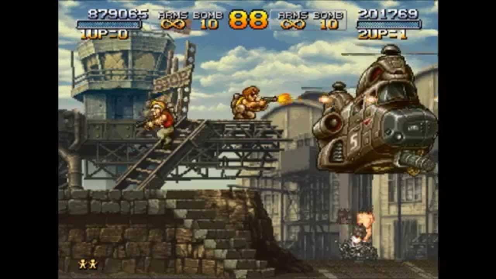

# METAL SLUG FRONTIER

**Operation Dune Breaker** — a browser-based 3D arcade shooter inspired by the
classic METAL SLUG series. Pilot the legendary **SV-001** tank across an
auto-scrolling desert front, blast through endless waves of infantry, armor,
and aircraft, and bring down massive boss machines.

Built with plain ES modules and [Three.js](https://threejs.org/) — no build
step, no bundler, no framework. Just open the page and play.



---

## Run

ES modules require an HTTP(S) origin, so serve the folder over a local web
server. The simplest option is Python's built-in server:

```bash
python3 -m http.server 8080
```

Then open <http://localhost:8080> in a modern browser (Chrome / Edge / Firefox
recommended for best WebGL performance).

No dependencies to install. Three.js v0.170.0 is loaded from a CDN via the
importmap inside `index.html`.

---

## Controls

| Input             | Action                                       |
| ----------------- | -------------------------------------------- |
| `W A S D` / Arrow | Move                                         |
| `SPACE`           | Jump (also START on title / game-over)       |
| `CTRL` / `C`      | Crouch                                       |
| `SHIFT` / `E`     | Boost dash                                   |
| Mouse             | Aim                                          |
| Left mouse        | Vulcan (auto-fire by default)                |
| Right mouse / `F` | Cannon (hold to charge, release to fire)     |
| `B`               | Bomb (hold to arc-aim)                       |
| `V`               | Toggle auto-fire (hold = manual fire)        |
| `Q`               | Dismount SV-001 / re-board                   |
| `R`               | Restart (on game over)                       |
| `M`               | Mute toggle                                  |

---

## Gameplay

- **Auto-scrolling 3D world** along the world `+Z` axis with a 3/4 chase
  camera, capturing the side-scrolling feel of the arcade originals in full
  3D.
- **Two pilot modes** — drive the **SV-001** tank with vulcan + chargeable
  cannon, or dismount (`Q`) and fight on foot as **Marco** with handgun,
  grenades, and pickup weapons.
- **Wave-based progression** — over 30 waves of escalating combined-arms
  attacks: rifle infantry, knife rushers, rocketeers, shielded troopers,
  grenadiers, snipers, ninjas, juggernauts, commandos, demolition troops,
  flak / siege / heavy tanks, scout & attack helicopters, bombers, fighters,
  interceptors, gunships, and razor drones.
- **Boss fights** — four large multi-phase bosses including DI-COKKA,
  HI-DO, IRON NOKANA, and TANI-OH, each with distinct phases, turret arrays,
  and finale sequences.
- **Pickups & rescues** — destroy crates and rescue **POW**s for score
  bonuses, weapon power-ups (Heavy Machinegun, Rocket Launcher, etc.), and
  bomb resupply.
- **Combo system** — chained kills boost the score multiplier; the kill feed
  on the right rail tracks your engagement log live.

---

## Architecture

This is a single-page browser app — no build pipeline.

```
index.html             Entry point. Importmap → three@0.170.0 from CDN.
css/style.css          All HUD / overlay styling.
audio/                 BGM (title + battle) as OGG.
concept_images/        Reference artwork and screenshots.
js/
  main.js              Composition root: scene, camera, renderer, game loop,
                       memory-pressure monitor, adaptive resolution.
  World.js             Scrolling desert world. Chunked prop generation with
                       shared geometry/material caches.
  GameManager.js       Wave system, spawning, collisions, scoring, periodic
                       cleanup.
  UIManager.js         HUD, combo display, kill feed, score popups, minimap,
                       wave announcements, game-over screen.
  InputManager.js      Keyboard + mouse input normalization.
  SoundManager.js      BGM + SFX pooling, mute toggle.
  Player.js            SV-001 tank: aim arc, vulcan, charge cannon, dash,
                       damage states.
  Marco.js             On-foot mode (handgun, grenades, weapon pickups).
  Enemy.js             Base enemy class (HP, AI state, fire, hit flash).
  Infantry.js          Infantry subtypes (rifle, knife, rocket, shield,
                       grenade, machinegun, officer, flamethrower, mummy,
                       sniper, hunter, ninja, juggernaut, commando,
                       demolition).
  EnemyTank.js         Ground armor (light, heavy, flak, siege).
  Aircraft.js          Airborne (scout heli, attack heli, bomber, fighter,
                       drone, interceptor, gunship, tomahawk).
  Boss.js              Boss models + multi-phase AI (DI-COKKA, HI-DO,
                       IRON NOKANA, TANI-OH).
  Projectile.js        Bullets / cannon shells / rockets / bombs.
  Explosion.js         Muzzle / small / large explosions with shockwave +
                       scorch. Uses shared geometry cache.
  ItemDrop.js          Pickup items (HMG, rocket, bomb refill, etc.).
  POW.js               Rescue NPCs (free for bonus + supply drop).
```

### Update contract

Each frame, `main.js` drives the following update chain:

```js
player.update(dt, input, elapsedTime);
// or in on-foot mode:
// marco.update(dt, input, scrollZ);

gameManager.update(dt, activeEntity, elapsedTime);
world.update(dt, scrollZ);
uiManager.update(dt, gameManager, activeEntity);
```

### Coordinate system

- `+Z` is world forward (scroll direction).
- `X` is lateral, `Y` is up.
- Player visual root is rotated `-π/2` around `Y` so local `+X` faces world
  `+Z`. Enemy aim logic also assumes local `+X` is model forward.

### Memory & performance

Long play sessions allocate a lot of meshes, materials, and DOM nodes. The
runtime applies several layered defenses:

- **Shared geometry & material caches** in `World.js` (`_sharedGeo`,
  `_sharedMat`) — large props (electric pylon, satellite cluster,
  propaganda billboard, market awning, burnt car, urban rubble pile, etc.)
  reuse cached `BoxGeometry` / `CylinderGeometry` / `SphereGeometry` /
  `PlaneGeometry` and `MeshStandardMaterial` instances rather than
  allocating new ones per chunk. Random dimensions are quantized into bins
  so cache hits stay high.
- **`Explosion._geoCache`** keeps shockwave / debris geometries shared
  across all simultaneous blasts.
- **`GameManager.cleanupTimer`** periodically purges off-screen enemies,
  projectiles, effects, items, and POWs.
- **Non-active character purge** — when piloting SV-001, leftover Marco
  projectiles/effects (and vice versa) are removed in `main.js`.
- **Boss-spawned-effect tracking** — `Boss._spawnedEffects` keeps weak
  references to muzzle flashes / part-destruction blasts and is trimmed
  every 2 s during the fight, with a full purge on boss defeat.
- **Memory-pressure monitor** in `main.js` samples
  `renderer.info.memory.{geometries,textures}`, `renderer.info.render.calls`,
  `renderer.info.programs.length`, and (on Chrome)
  `performance.memory.usedJSHeapSize` every 0.5 s, escalating to High /
  Critical pressure levels that cap effects, drop pixel ratio, force
  chunk disposal, and dispose the renderer's render-list cache.
- **Adaptive resolution** — pixel ratio is reduced automatically when FPS
  drops.
- **Wave-scaled UI caps** — at higher waves, kill-feed and score-popup
  caps + lifetimes shrink so the DOM doesn't bloat during heavy combat.
- **`destroy()` discipline** — every class that allocates Three.js
  resources implements `destroy()` and disposes (non-shared) geometries and
  materials.

---

## Notes for contributors

- The codebase is plain ES modules. Edit any `.js` file under `js/` and
  reload — no build, no transpile.
- There is no lint / test pipeline. Run `node --check js/<file>.js` for a
  quick syntax check.
- When adding new visual objects, ensure they are removed and disposed in
  reset and cleanup paths.
- Prefer reusing existing helpers (`_sharedGeo`, `_sharedMat`, the various
  `destroy()` / hit-sphere patterns) over hand-rolled allocations.
- See `CLAUDE.md` for additional architectural notes intended for AI-assisted
  edits.

---

## Credits

- Inspired by SNK / Playmore's METAL SLUG series. This is a fan project,
  not affiliated with or endorsed by any rights holder.
- 3D rendering via [Three.js](https://threejs.org/).
- Background music and reference images are placed under `audio/` and
  `concept_images/` respectively for atmosphere and design reference.
